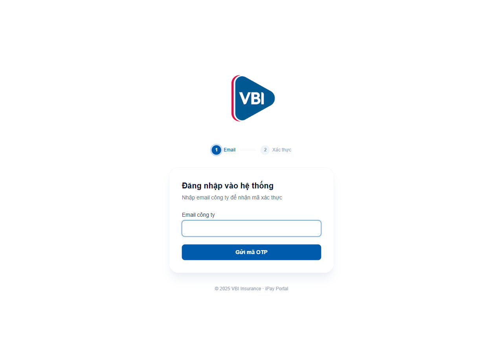
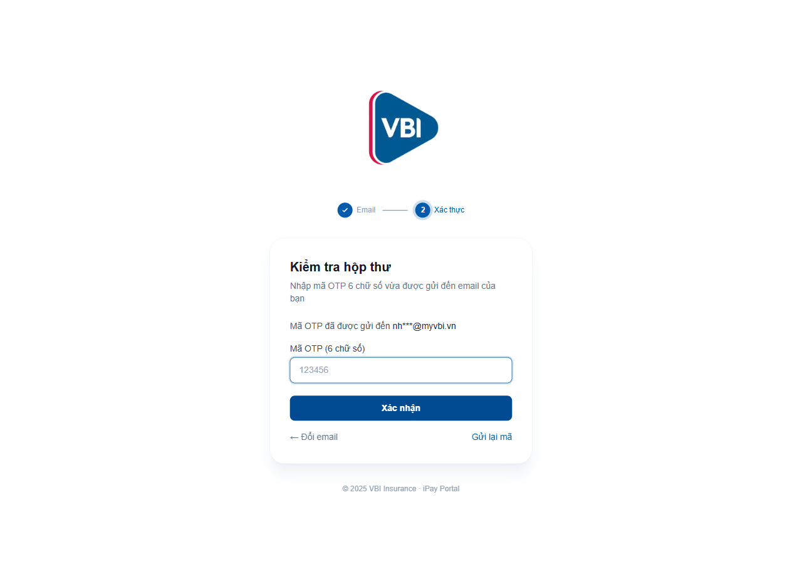
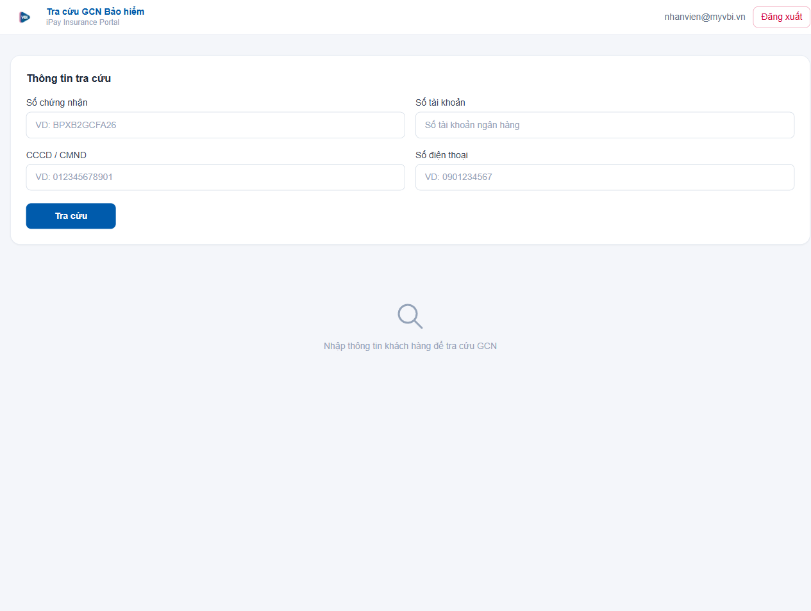
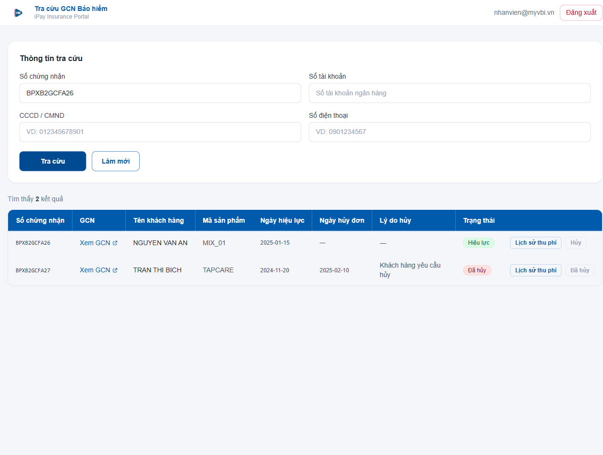
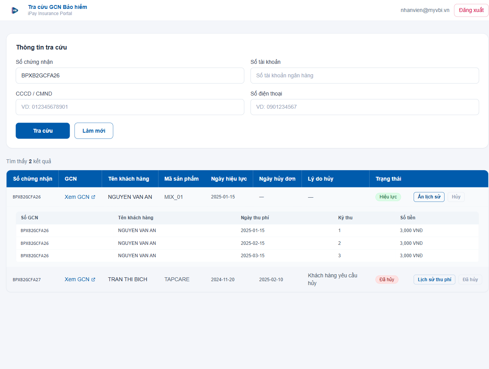
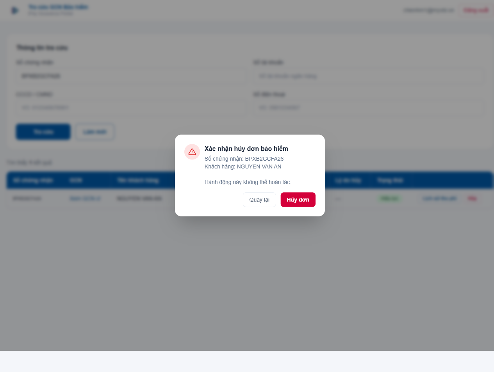
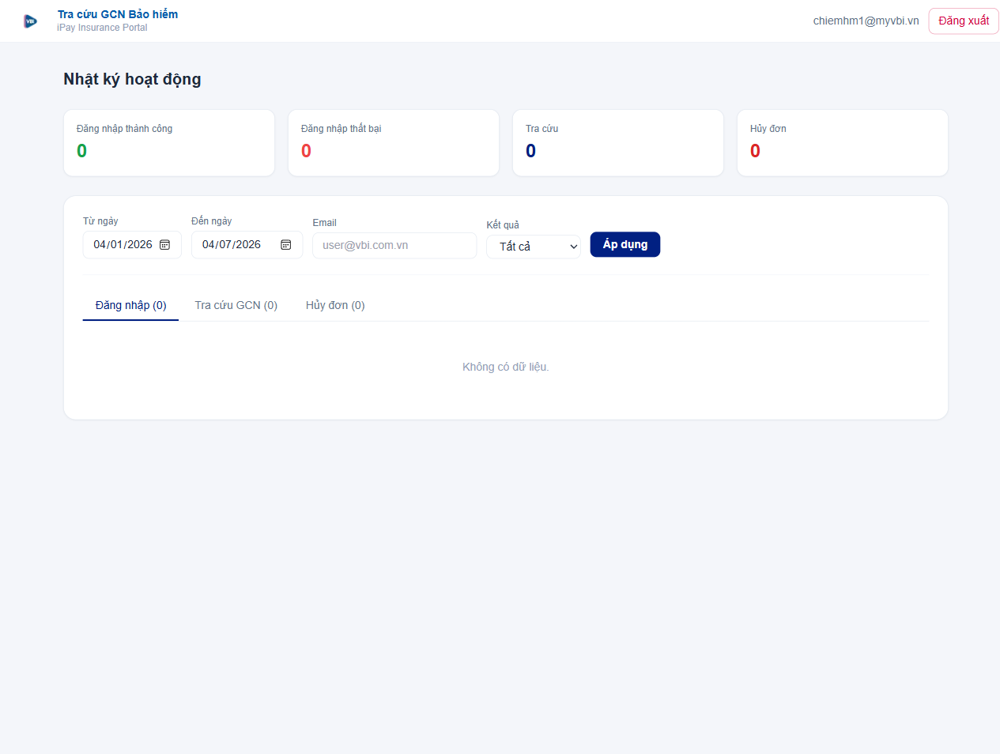

# Hướng dẫn sử dụng — Hệ thống Tra cứu GCN Bảo hiểm iPay

**Dành cho:** Nhân viên Chăm sóc Khách hàng VBI  
**Phiên bản:** 1.0 — Tháng 4/2025

---

## Mục lục

1. [Tổng quan](#1-tổng-quan)
2. [Đăng nhập](#2-đăng-nhập)
3. [Tra cứu Giấy chứng nhận](#3-tra-cứu-giấy-chứng-nhận)
4. [Đọc kết quả tra cứu](#4-đọc-kết-quả-tra-cứu)
5. [Xem lịch sử thu phí](#5-xem-lịch-sử-thu-phí)
6. [Hủy đơn bảo hiểm](#6-hủy-đơn-bảo-hiểm)
7. [Nhật ký hoạt động (Admin)](#7-nhật-ký-hoạt-động-admin)
8. [Xử lý các tình huống thường gặp](#8-xử-lý-các-tình-huống-thường-gặp)

---

## 1. Tổng quan

Hệ thống **Tra cứu GCN Bảo hiểm iPay** là công cụ nội bộ giúp nhân viên VBI tra cứu nhanh thông tin Giấy chứng nhận (GCN) bảo hiểm của khách hàng được bán qua kênh iPay.

**Các chức năng chính:**
- Tra cứu GCN theo nhiều tiêu chí (số chứng nhận, CCCD, số điện thoại, số tài khoản)
- Xem file GCN gốc (PDF/link)
- Xem lịch sử thu phí theo từng kỳ
- Hủy đơn bảo hiểm (chỉ tài khoản được cấp quyền)
- Xem nhật ký hoạt động (chỉ Admin)

---

## 2. Đăng nhập

Hệ thống sử dụng xác thực **OTP qua email** — không cần mật khẩu.

### Bước 1 — Nhập email công ty

1. Truy cập địa chỉ ứng dụng trên trình duyệt.
2. Nhập địa chỉ email công ty (ví dụ: `ten.ban@myvbi.vn`).
3. Nhấn **Gửi mã OTP**.

> **Lưu ý:** Chỉ email thuộc domain công ty mới được phép đăng nhập. Nếu nhập email ngoài domain này, hệ thống sẽ từ chối.

### Bước 2 — Nhập mã OTP

1. Kiểm tra hộp thư email — bạn sẽ nhận được email chứa **mã OTP gồm 6 chữ số**.
2. Nhập mã OTP vào ô xác thực.
3. Nhấn **Xác nhận**.

> **Lưu ý:** Mã OTP có hiệu lực trong **10 phút**. Nếu hết hạn, nhấn **← Đổi email** và yêu cầu mã mới.

Sau khi xác thực thành công, bạn sẽ được chuyển tự động đến trang tra cứu.

---

## 3. Tra cứu Giấy chứng nhận

### Các tiêu chí tìm kiếm

Trang tra cứu có **4 ô nhập liệu**. Bạn chỉ cần điền **ít nhất 1 ô** để tìm kiếm:

| Ô nhập liệu | Ý nghĩa | Ví dụ |
|---|---|---|
| **Số chứng nhận** | Mã GCN của đơn bảo hiểm | `BPXB2GCFA26` |
| **Số tài khoản** | Số tài khoản ngân hàng của khách | `0123456789` |
| **CCCD / CMND** | Số căn cước công dân hoặc CMND | `012345678901` |
| **Số điện thoại** | Số điện thoại đăng ký | `0901234567` |

Có thể kết hợp nhiều tiêu chí để thu hẹp kết quả.

### Thực hiện tra cứu

1. Nhập thông tin vào ít nhất một ô.
2. Nhấn **Tra cứu**.
3. Hệ thống hiển thị kết quả bên dưới form.

### Xóa và tìm kiếm lại

- Nhấn **Làm mới** để xóa toàn bộ ô nhập liệu và kết quả, bắt đầu tìm kiếm mới.

---

## 4. Đọc kết quả tra cứu

Kết quả hiển thị dạng bảng với các cột sau:

| Cột | Nội dung |
|---|---|
| **Số chứng nhận** | Mã định danh duy nhất của GCN |
| **GCN** | Liên kết mở file GCN gốc (nhấn **Xem GCN** để mở tab mới) |
| **Tên khách hàng** | Họ tên người mua bảo hiểm |
| **Mã sản phẩm** | Mã sản phẩm bảo hiểm (ví dụ: `MIX_01`, `TAPCARE`) |
| **Ngày hiệu lực** | Ngày đơn bảo hiểm bắt đầu có hiệu lực |
| **Ngày hủy đơn** | Ngày đơn bị hủy (trống nếu vẫn hiệu lực) |
| **Lý do hủy** | Lý do hủy đơn (nếu có) |
| **Trạng thái** | Badge trạng thái hiện tại của đơn |

### Các trạng thái đơn

| Badge | Ý nghĩa |
|---|---|
| **Hiệu lực** (xanh lá) | Đơn bảo hiểm đang còn hiệu lực |
| **Đã hủy** (đỏ) | Đơn đã bị hủy |

### Không tìm thấy kết quả

Nếu hệ thống không tìm thấy dữ liệu khớp với tiêu chí đã nhập, màn hình sẽ hiển thị thông báo **"Không tìm thấy kết quả"**. Kiểm tra lại thông tin nhập vào và thử lại.

---

## 5. Xem lịch sử thu phí

Mỗi dòng kết quả có nút **"Lịch sử thu phí"** ở cột cuối.

1. Nhấn **Lịch sử thu phí** để mở bảng lịch sử bên dưới dòng đó.
2. Bảng hiển thị các cột: Số GCN, Tên khách hàng, Ngày thu phí, Kỳ thu, Số tiền.
3. Nhấn **Ẩn lịch sử** để thu gọn lại.

### Mức phí theo sản phẩm

| Mã sản phẩm | Phí/kỳ |
|---|---|
| MIX_01 | 3,000 VNĐ |
| TAPCARE | 6,000 VNĐ |
| ISAFE_CYBER | 5,000 VNĐ |
| VTB_HOMESAVING | 25,000 VNĐ |

---

## 6. Hủy đơn bảo hiểm

> **Quan trọng:** Chức năng hủy đơn chỉ khả dụng với **một số tài khoản được cấp quyền cụ thể**. Nếu bạn không thấy nút **Hủy** có thể nhấn (không bị xám), tài khoản của bạn chưa được cấp quyền này.

### Quy trình hủy đơn

1. Tra cứu và tìm thấy đơn cần hủy.
2. Nhấn nút **Hủy** (màu đỏ) ở cuối dòng tương ứng.
3. Hộp thoại xác nhận xuất hiện, hiển thị:
   - Số chứng nhận
   - Tên khách hàng
   - Cảnh báo: hành động **không thể hoàn tác**
4. Nhấn **Hủy đơn** để xác nhận, hoặc **Quay lại** để hủy thao tác.
5. Sau khi hủy thành công, danh sách kết quả tự động tải lại — trạng thái đơn chuyển sang **Đã hủy**.

### Trường hợp nút Hủy bị xám

- **"Đã hủy"**: Đơn đã được hủy trước đó, không thể hủy lại.
- **"Hủy" (xám, không nhấn được)**: Tài khoản hiện tại không có quyền hủy đơn. Liên hệ quản lý để được cấp quyền nếu cần.

---

## 7. Nhật ký hoạt động (Admin)

Trang **Admin** chỉ dành cho tài khoản được chỉ định là Admin.

Trang này hiển thị **nhật ký toàn bộ các thao tác** đã được thực hiện trên hệ thống với các bộ lọc: khoảng ngày, email người dùng, loại sự kiện (Đăng nhập / Tra cứu GCN / Hủy đơn) và kết quả.

Nếu bạn truy cập trang Admin mà không có quyền, hệ thống tự động chuyển hướng về trang tra cứu.

---

## 8. Xử lý các tình huống thường gặp

### Không nhận được email OTP

- Kiểm tra **thư mục Spam/Junk** trong hộp thư.
- Chờ 1–2 phút rồi thử lại.
- Nếu vẫn không nhận được, nhấn **← Đổi email** trên trang OTP và yêu cầu gửi lại mã.

### Mã OTP bị lỗi / hết hạn

- Mã OTP chỉ có hiệu lực **10 phút** kể từ khi được gửi.
- Nhập đúng 6 chữ số, không có khoảng trắng.
- Nếu hết hạn, quay lại bước nhập email để yêu cầu mã mới.

### Tra cứu không ra kết quả dù chắc chắn khách có đơn

- Kiểm tra lại thông tin nhập: CCCD, số điện thoại phải **khớp chính xác** với thông tin đăng ký.
- Thử tra cứu bằng tiêu chí khác (ví dụ: dùng số chứng nhận thay vì số điện thoại).
- Nếu vẫn không ra kết quả, liên hệ bộ phận kỹ thuật để kiểm tra phía hệ thống VBI.

### Lỗi "Không thể kết nối đến hệ thống"

- Kiểm tra kết nối mạng internet.
- Thử tải lại trang (F5) và thực hiện lại.
- Nếu lỗi kéo dài, liên hệ bộ phận kỹ thuật.

### Hủy đơn thất bại — hiển thị thông báo lỗi đỏ

- Đọc nội dung lỗi để xác định nguyên nhân (ví dụ: đơn đã được xử lý ở phía VBI).
- Nhấn **X** để đóng thông báo lỗi.
- Chụp màn hình thông báo lỗi và báo cáo cho bộ phận kỹ thuật nếu cần xử lý tiếp.

---

*Nếu gặp vấn đề không được đề cập trong hướng dẫn này, vui lòng liên hệ bộ phận phát triển hệ thống.*
